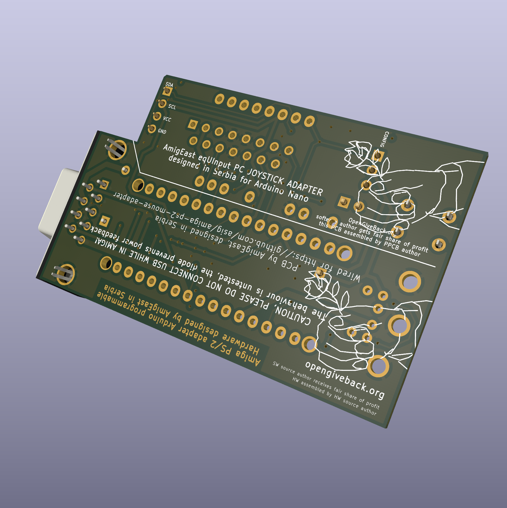

**Arduino Nano based Amiga PS/2 mouse adapter PCB revision 1.7**

Made with nostalgia in Serbia. :)

An experimental PCB to enable using existing Arduino Nano based sourcecode to convert PS/2 mouse to Amiga mouse signals. Also has an additional Gameport connector wired to appropriate analogue input pins on Arduino Nano, to enable connecting an analogue old PC joystick, a button (for selecting mouse resolution), and even an I2C connection for PinSockets 2.54mm, to allow for connecting other I2C devices (accelerometers or screens).

Pins were selected to suit this software opensource project : https://github.com/asig/amiga-ps2-mouse-adapter

Licensed under GPL3.
The PCB is provided "AS IS", no warranties of correctness or fitness for purpose are implied nor expressed. You use the schematic on your own responsability, if you break something using it, or make stuff blow up and burn and destroy things/harm someone, it is not my fault. Use on your own responsibility. Be warned.

**Caution! Please note!
NEVER connect Arduino Nano to  USB power source and Amiga at the same time! The design only has a diode from power source pin from Amiga joyport, to prevent powering Amiga from the device, but other considerations were not made. Take care to not draw more than 50mA, as 100mA is max. for both Amiga Joyports, and some Amigas (Amiga 500?) don't have proper protection from overdraw. Beware of excess RGB and DPI resolution.**

The Arduino Nano can be socketed to be able to reuse it for other Arduino Nano projects! Insert Arduino Nano with USB facing DB9 connector and do not connect USB cable to inserted Arduino Nano!

This is a small revision of v1.1 of the design. As v1.0 had wrongl wired gnd, so wire had to be added from DB9 to gnd on the mounting hole of DB9 connector. I also modified and used the PCB for an PS/2 to MSX mouse convertor project, tested working OK, that version is available in a separate repository https://github.com/opengiveback/eqUInputMSX

Arduino Nano pins connections
-----------------------------
3 = P_PS2_CLK

2 = P_PS2_DATA

1 = Button MouseDPI

0 = GamePort Button1

A0 = GamePort Axis X1

A3 = GamePort Axis Y1

5 = GamePort Button2

13 = GamePort Button3

A1 = GamePort Axis X2

A2 = GamePort Axis Y2

A6 = GamePort Button4

A4, A5 = I2C connector

// Output pins
12 = P_AMIGA_V_PULSE

11 = P_AMIGA_H_PULSE

10 = P_AMIGA_VQ_PULSE

9 = P_AMIGA_HQ_PULSE

8 = P_AMIGA_LMB

7 = P_AMIGA_RMB

6 = P_AMIGA_MMB

Design change log
-----------------

Revision 1.7.
Pullup resistors (10k) for buttons and pulldown resistors (100k) for analog lines of Gameport were added in revision 1.7.

Revision 1.6.
5v wiring was corrected for the optional gameport and i2c oled connectors.

If you make it and sell it, please consider I declare my opengiveback.org principle requirements at 15% (FAIR) of earnings. Check out more about my opengiveback.org concept at www.opengiveback.org
